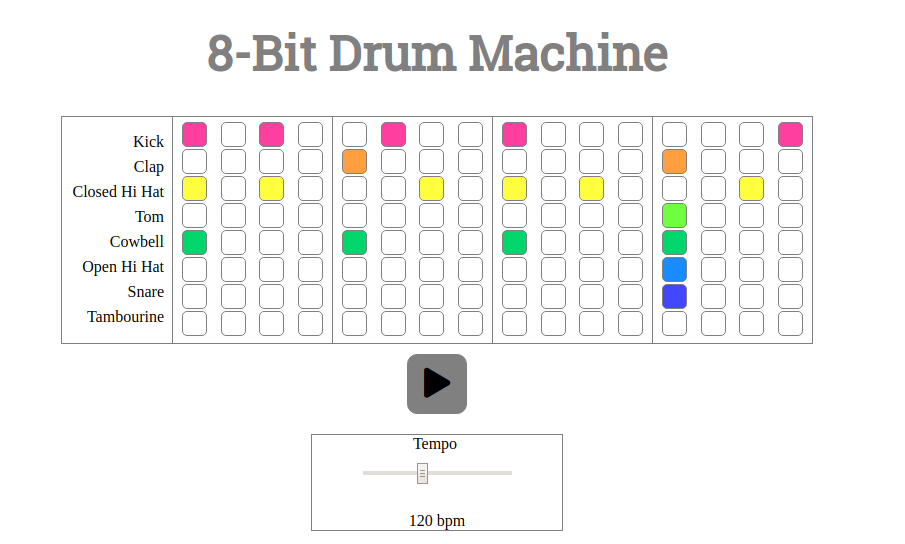

## 8-Bit Drum Machine

[Drum machine](https://en.wikipedia.org/wiki/Drum_machine "Drum Machine - Wikipedia") using 8-bit sounds, made with vanilla JavaScript and CSS.

------

Instructions: Use the buttons to create a pattern, then press play to hear it in action.  Change the tempo using the slider (disabled while playing).

Play and stop icons are from [Font Awesome](https://fontawesome.com/ "Font Awesome").

8-bit samples are Bitkits from [Uppercussion](https://www.uppercussion.com/products/bitkits "Uppercussion").

Layout accomplished with CSS grid.

Through this project, I learned how to use the following:
- setInterval
- working with audio
- how to format links with Markdown
